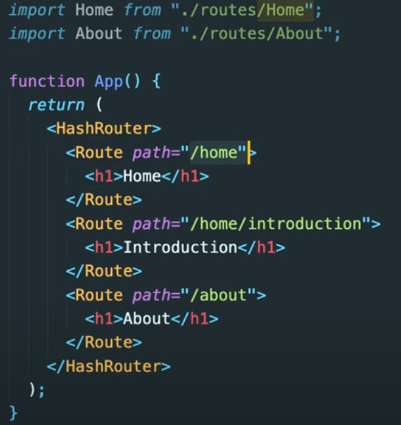
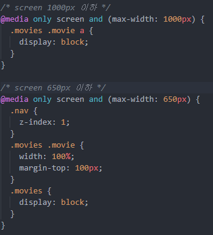

# ReactJS_Base

ReactJS로 영화 웹 서비스 만들기(Nomadcoder)

주소 : [ReactJS로 영화 웹 서비스 만들기](https://nomadcoders.co/react-fundamentals)

## React를 사용하는 이유

- 우선 React란 facebook에서 만든 javascript 라이브러리이며, 사용량이 많다. 즉, 커뮤니티, 모듈, 스터디 등이 활발하게 이루어져서 배우고 개발하기 좋다.
- 모바일앱으로 내기에 쉽다. 리액트는 싱글 페이지로 개발이 진행되기에 페이지 이동 간 새로고침 단계가 없어진다. 즉, 모바일앱처럼 부드러운 이동이 된다는 것.
- 컴포넌트를 사용하기에 분리하여 작업할 수 있다. 이는 객체 지향과 상당히 비슷하기에 코드의 재사용이 가능하며 유지 및 관리에 용이하다.
- 위의 기능을 스마트하게 도와주는 것이 Vitual DOM 기능이다. 리액트는 변화가 있는 곳을 감지하여 먼저 Vitual DOM에서 한번 바꾸고 이를 사용중인 DOM과 비교하여 틀린 곳만 업데이트하는 형식으로 진행된다. 복잡한 싱글 페이지 어플리케이션(SPA)에선 DOM조작이 빈번하게 발생되는데 그러한 변화를 적용하기 위해서는 브라우저가 많은 연산을 해야하니 전체적인 프로세스를 비효율적으로 만든다. 즉, Virtual DOM을 사용하고 사용 도중 뷰에 변화가 있다면, 그 변화는 실제 DOM 에 적용되기전에 가상의 DOM 에 먼저 적용시키고 그 최종적인 결과를 실제 DOM 으로 전달하기에 브라우저가 처리해야할 연산의 양이 줄어들면서 성능이 개선된다. ([참고 글](https://velopert.com/3236))

### async, await(javascript)

- async, await : axios로 데이터를 가져오는 건 빠르지 않다. 그렇기에 데이터를 가져올 때까지 기다려달라고 요청할 필요가 있다. 이때 사용하는 것이 async, await이다.

```
getMovies = async () => {
    const {
      data: {
        data: { movies },
      },
    } = await axios.get(
      "https://yts-proxy.now.sh/list_movies.json?sort_by=rating"
    );
    this.setState({ movies, isLoding: false });
  };
```

### url 동작 방식



- url이 동작하는 방식은 위의 이미지를 보면 /home, /home/introduction이 있는데 먼저 /home으로 들어가면 Home이란 글자가 보이고 /home/introduction으로 들어가면 Introductio만 보이는 것이 아닌 HomeIntroduction으로 보이는 것을 볼 수 있다. 그 이유는 url이 같은 이름을 가진 /home을 비교하여 같은 라우터가 있다면 그 뒤에 주소로 들어가 그 주소에 있는 내용도 같이 렌더링해주기 떄문이다.

- 이를 방지하기 위해 exact={true} 라는 옵션을 넣으면 된다.

```
<Route path="/" exact={true} component={Home} />
```

### componentDidmount()

- class component내에서 render가 실행되기 전에 (mount되기전에) 실행된다.

### Responsive Web Design(CSS) - Media Queries



- media querie를 이용하여 해당 크기에 맞게 css를 조절해준다.

# Movie App 2020

React JS Fundamentals Course

- 결과 : [[Movie App]](https://kyeongmin-log.github.io/reactjs_base/)
- [수료증](https://nomadcoders.co/certs/fe3961a0-a3b6-4f49-889a-3d1bcfe0a270)
